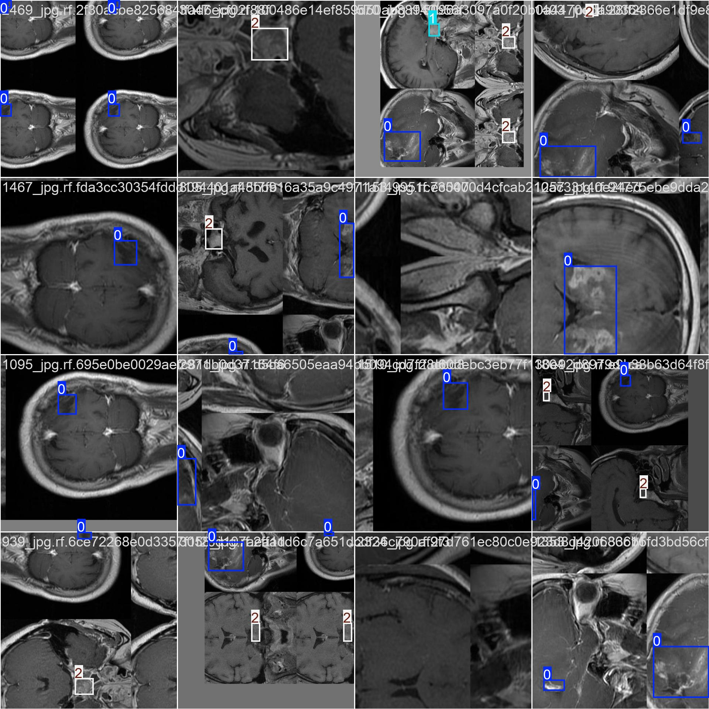
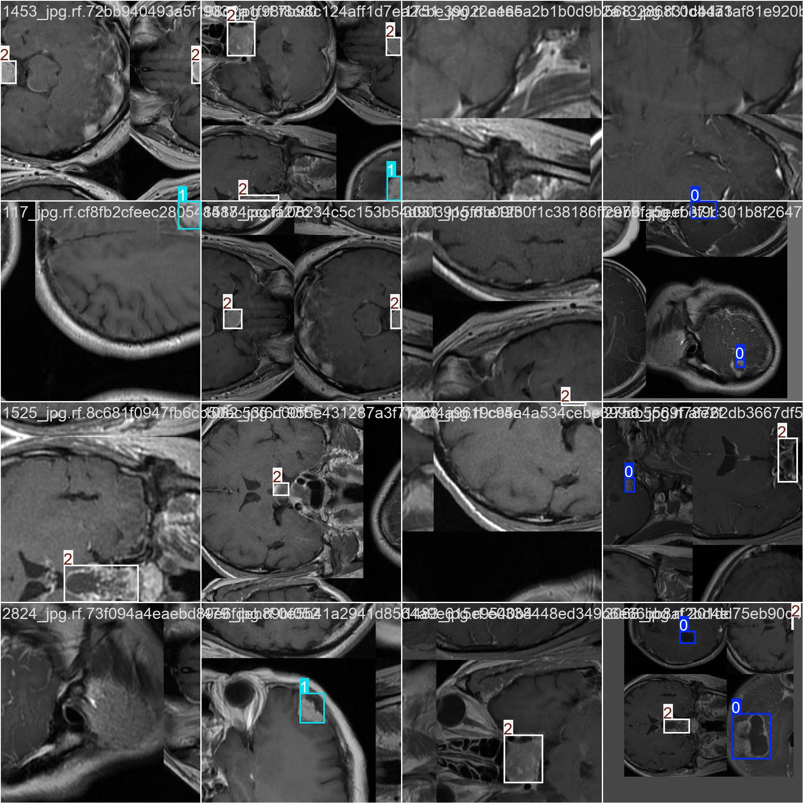
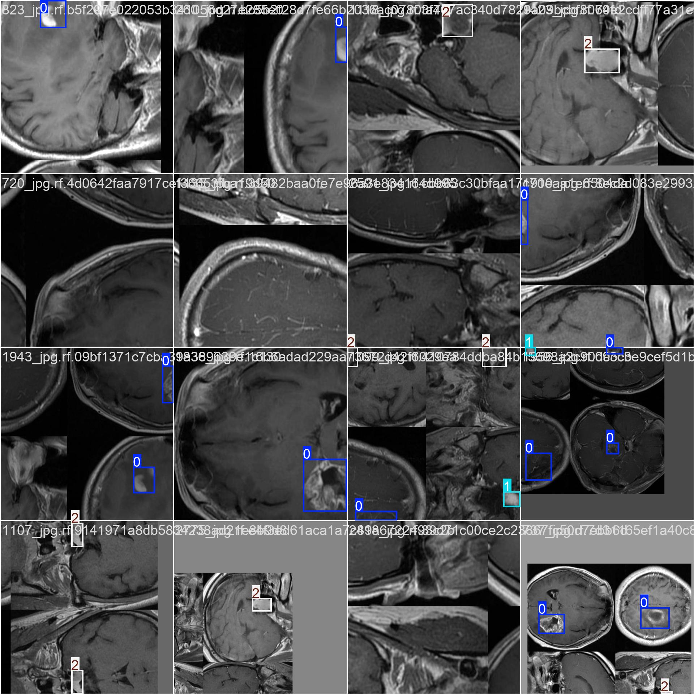
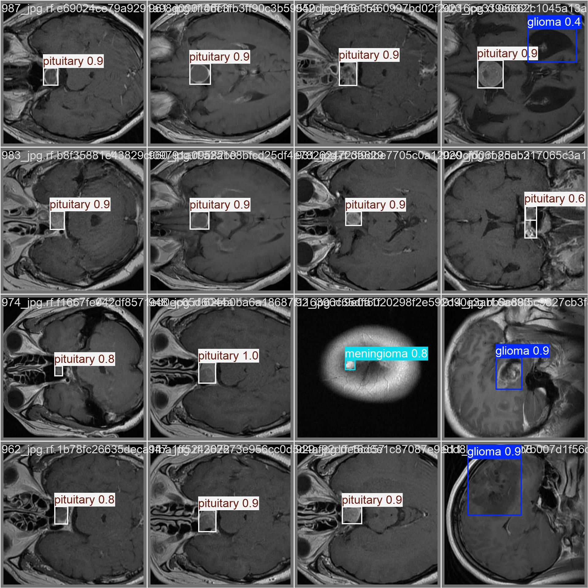
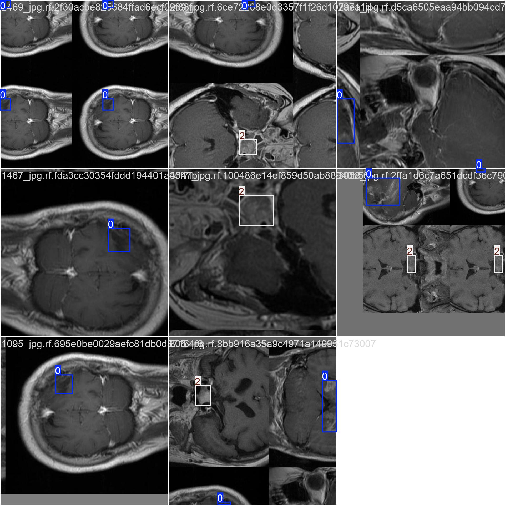
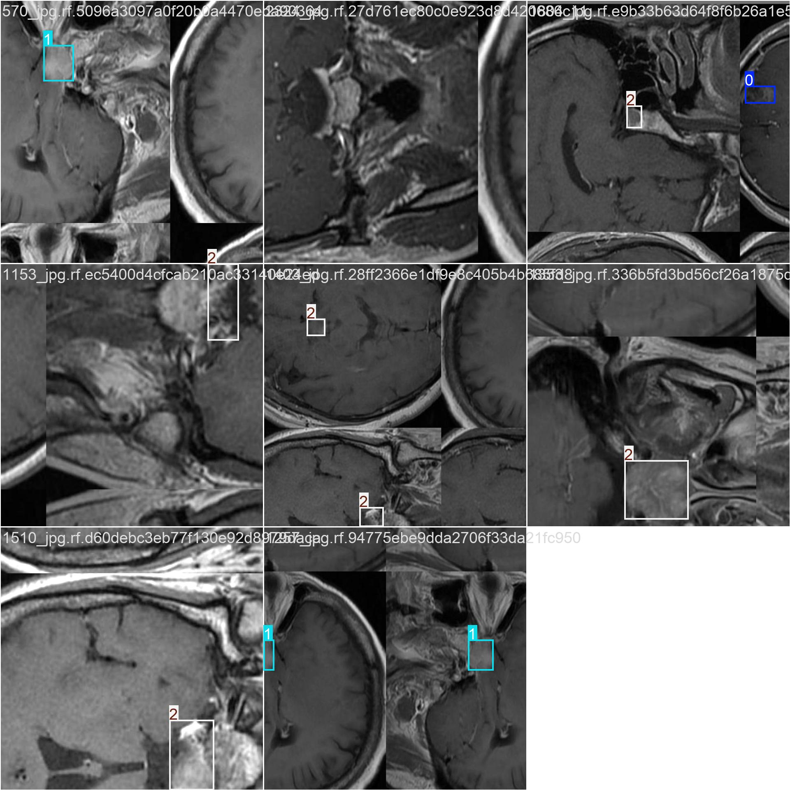
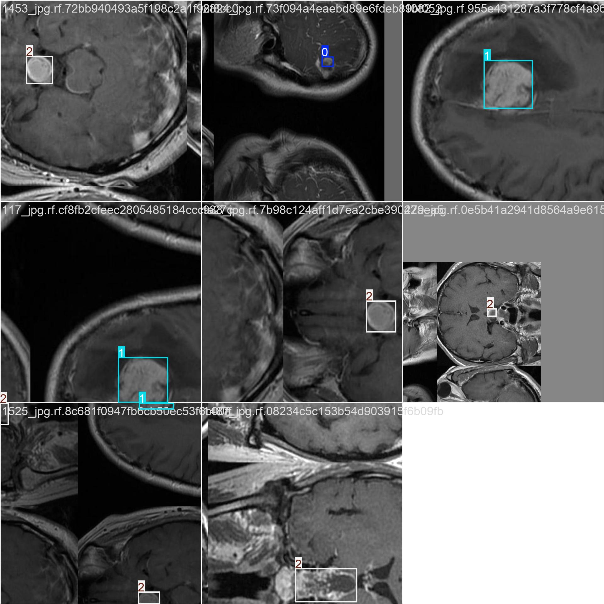
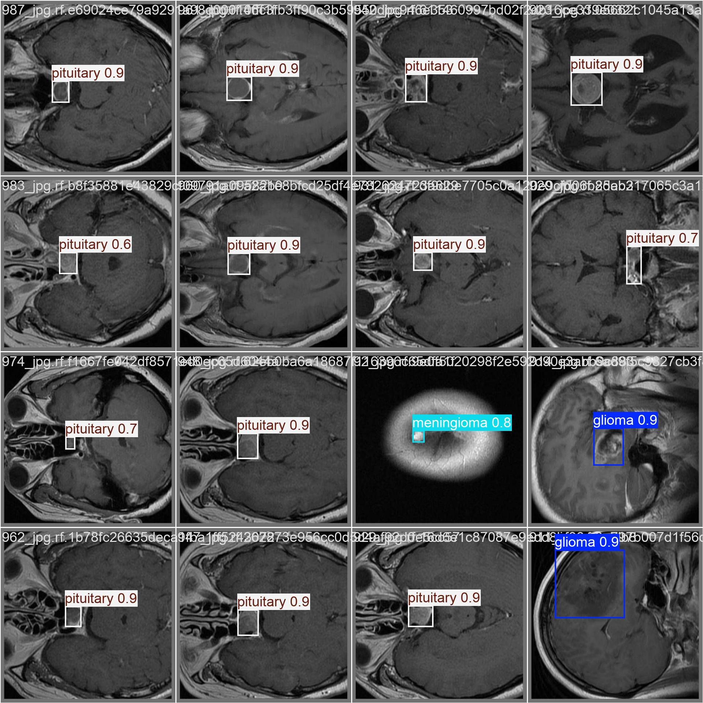
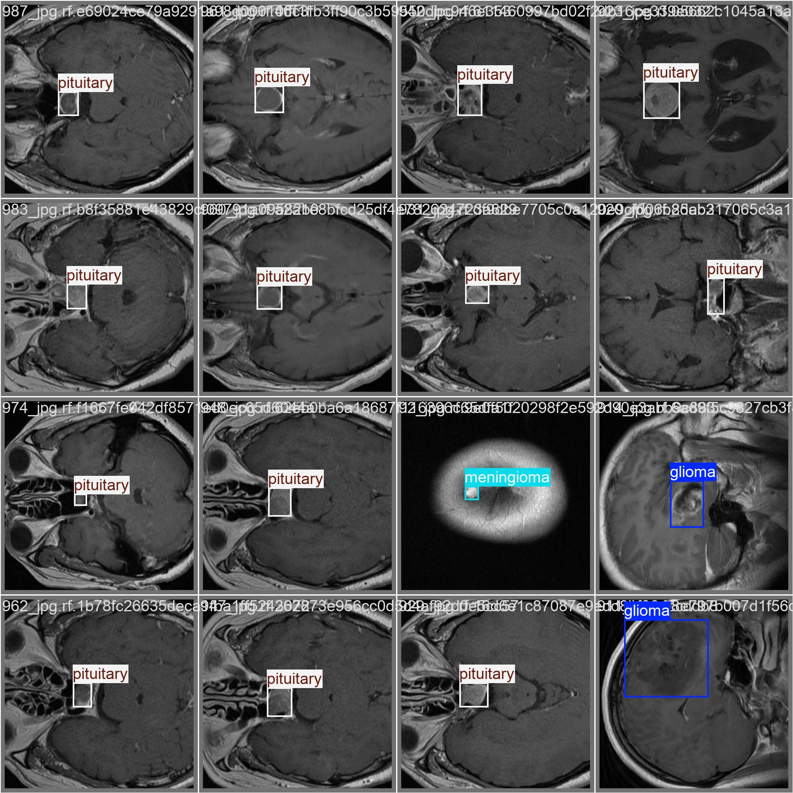
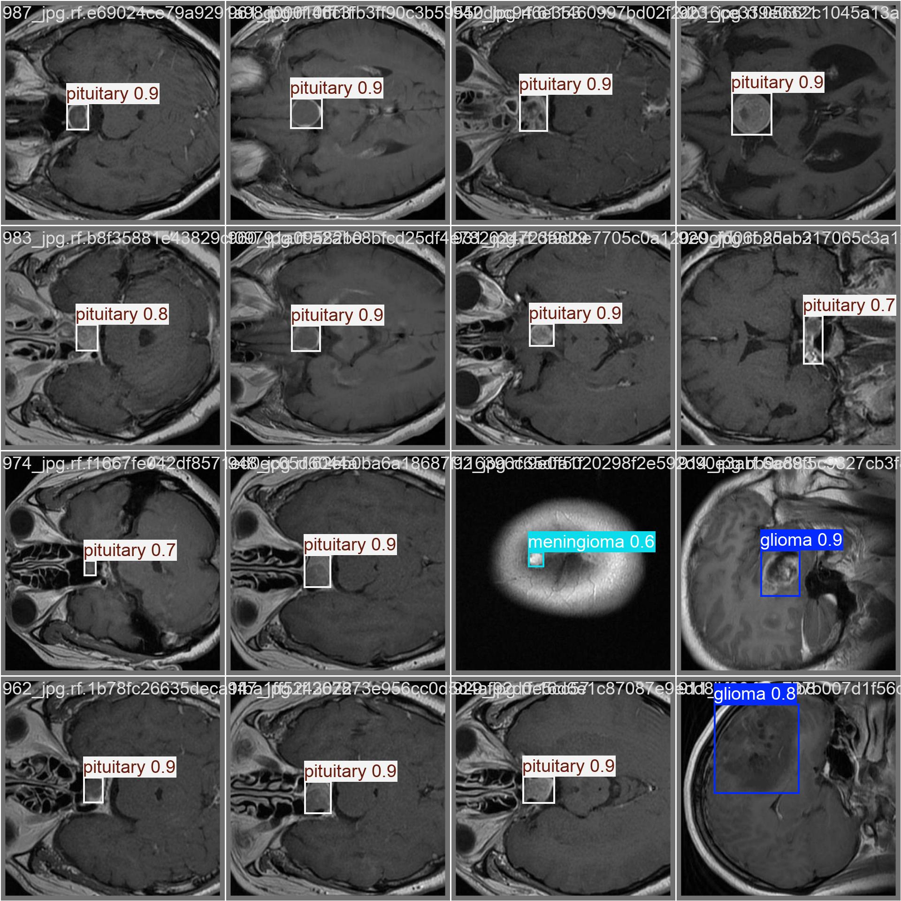

# YOLO Nesne Algılama Modelleri ile Beyin Tümörü Tespiti

<div align="center">

**Tıbbi Görüntü Nesne Algılama için YOLOv8, YOLOv9 ve YOLOv10 Karşılaştırmalı Analizi**

[](https://www.python.org/)
[](https://github.com/ultralytics/ultralytics)
[](https://creativecommons.org/licenses/by/4.0/)

</div>

---

## 📋 Proje Genel Bakış

Bu proje, tıbbi görüntülemede otomatik beyin tümörü tespiti için üç son teknoloji YOLO (You Only Look Once - Sadece Bir Kez Bak) nesne algılama modelini uygular ve karşılaştırır. Amaç, aynı beyin tümörü veri seti üzerinde **YOLOv8s**, **YOLOv9n** ve **YOLOv10s** arasındaki performans dengelerini değerlendirmektir.

### Tıbbi Bağlam

Beyin tümörleri, etkili tedavi planlaması için erken ve doğru tespit gerektiren en ciddi tıbbi durumlar arasındadır. Bu proje, üç tip beyin tümörünü otomatik olarak tanımlamak ve sınıflandırmak için derin öğrenme tabanlı nesne algılamayı kullanır:
- **Glioma (Gliom)** - Beyin ve omurilikde oluşan bir tümör türü
- **Meningioma (Meningiom)** - Meninksten kaynaklanan bir tümör
- **Pituitary (Hipofiz)** - Hipofiz bezinde oluşan bir tümör

Geleneksel sınıflandırma yaklaşımlarından farklı olarak, nesne algılama hem tümör lokalizasyonu hem de sınıflandırma sağlar, bu da tıbbi teşhis ve tedavi planlaması için kritik öneme sahiptir.

---

## 📊 Veri Seti

### Kaynak
**Beyin Tümörü Veri Seti** - [Roboflow Universe](https://universe.roboflow.com/academia-keleu/brain-tumor-bb6yj/dataset/1)

- **Çalışma Alanı**: academia-keleu
- **Proje**: brain-tumor-bb6yj
- **Versiyon**: 1
- **Lisans**: CC BY 4.0
- **Tarih**: 2024-07-04

### Sınıflar
Veri seti **3 tümör sınıfı** içerir:
```python
names: ['glioma', 'meningioma', 'pituitary']
```

### Veri Seti Yapısı
```
dataset/
├── train/
│   ├── images/     # ~2.062 eğitim görüntüsü
│   └── labels/     # YOLO format etiketler
├── valid/
│   ├── images/     # ~612 doğrulama görüntüsü
│   └── labels/     # YOLO format etiketler
└── test/
    ├── images/     # ~308 test görüntüsü
    └── labels/     # YOLO format etiketler
```

### Veri Yapılandırması (`data.yaml`)
```yaml
train: ../train/images
val: ../valid/images
test: ../test/images

nc: 3
names: ['glioma', 'meningioma', 'pituitary']
```

---

## 🛠️ Eğitim Ayarları

### Ortam
- **Python Versiyonu**: 3.8+
- **Framework**: Ultralytics YOLO
- **Donanım**: NVIDIA GPU (CUDA etkin)
  - Cihaz: `cuda:0` (GPU hızlandırma)
- **İşletim Sistemi**: Windows

### Kurulum
```bash
pip install ultralytics
```

### Eğitim Yapılandırması

Üç model de adil karşılaştırma için tutarlı parametrelerle eğitildi:

| Parametre | YOLOv8n | YOLOv9s | YOLOv10s |
|-----------|---------|---------|----------|
| **Epoch** | 30 | 30 | 30 |
| **Batch Boyutu** | 16 | 8 | 8 |
| **Görüntü Boyutu** | 640×640 | 640×640 | 640×640 |
| **Cihaz** | GPU (cuda:0) | GPU (cuda:0) | GPU (cuda:0) |
| **Optimizer** | Otomatik | Otomatik | Otomatik |
| **Önceden Eğitilmiş** | Evet (COCO) | Evet (COCO) | Evet (COCO) |
| **Workers** | 8 | 8 | 8 |
| **AMP** | True | True | True |

### Eğitim Komutları

#### YOLOv8n
```python
from ultralytics import YOLO

model = YOLO("yolov8n.pt")  # Önceden eğitilmiş modeli yükle
model.train(
    data="dataset/data.yaml",
    epochs=30,
    imgsz=640,
    device=0,
    batch=16
)
```

#### YOLOv9s
```python
from ultralytics import YOLO

model = YOLO("yolov9s.pt")
model.train(
    data="dataset/data.yaml",
    epochs=30,
    imgsz=640,
    device=0,
    batch=8
)
```

#### YOLOv10s
```python
from ultralytics import YOLO

model = YOLO("yolov10s.pt")
model.train(
    data="dataset/data.yaml",
    epochs=30,
    imgsz=640,
    device=0,
    batch=8
)
```

---

## 🏗️ Model Mimarileri

### YOLOv8s (Small)
- **Varyant**: YOLOv8 Nano (hafif versiyon)
- **Odak**: Hız ve doğruluk arasında denge
- **Mimari**: PAN-FPN boynu ile CSPDarknet omurgası
- **Neden seçildi**: Minimum hesaplama yükü ile gerçek zamanlı uygulamalar için ideal temel

### YOLOv9n (Nano)
- **Varyant**: YOLOv9 Small
- **Odak**: GELAN mimarisi ile geliştirilmiş özellik çıkarımı
- **Mimari**: Programlanabilir Gradyan Bilgisi (PGI) + GELAN
- **Neden seçildi**: Daha iyi gradyan akışı ile nesne algılamada en son gelişmeler

### YOLOv10s (Small)
- **Varyant**: YOLOv10 Small
- **Odak**: Uçtan uca algılama için NMS-siz mimari
- **Mimari**: NMS-siz eğitim için çift atama
- **Neden seçildi**: Azaltılmış son işleme yükü ile en ileri model

---

## 📈 Eğitim Sonuçları

### YOLOv8n Eğitim Performansı

**Son Metrikler (Epoch 30)**
| Metrik | Değer |
|--------|-------|
| Precision (B) | %92.17 |
| Recall (B) | %83.87 |
| mAP50 (B) | %91.78 |
| **mAP50-95 (B)** | **%71.73** |
| Box Loss (val) | 0.9375 |
| Class Loss (val) | 0.6628 |
| DFL Loss (val) | 1.1952 |

**Eğitim Grafikleri**


**Karışıklık Matrisi**


**Performans Grafikleri**

| Precision | Recall | F1-Skor | PR Eğrisi |
|:---------:|:------:|:-------:|:---------:|
|  |  |  |  |

**Eğitim Örnekleri**

| Batch 0 | Batch 1 | Batch 2 |
|:-------:|:-------:|:-------:|
|  |  |  |

**Doğrulama Tahminleri**

| Etiketler | Tahminler |
|:---------:|:---------:|
|  |  |

---

### YOLOv9s Eğitim Performansı

**Son Metrikler (Epoch 30)**
| Metrik | Değer |
|--------|-------|
| Precision (B) | %88.96 |
| Recall (B) | %86.19 |
| mAP50 (B) | %91.35 |
| **mAP50-95 (B)** | **%70.79** |
| Box Loss (val) | 0.9453 |
| Class Loss (val) | 0.6577 |
| DFL Loss (val) | 1.3971 |

**Eğitim Grafikleri**


**Karışıklık Matrisi**


**Performans Grafikleri**

| Precision | Recall | F1-Skor | PR Eğrisi |
|:---------:|:------:|:-------:|:---------:|
|  |  |  |  |

**Eğitim Örnekleri**

| Batch 0 | Batch 1 | Batch 2 |
|:-------:|:-------:|:-------:|
|  |  |  |

**Doğrulama Tahminleri**

| Etiketler | Tahminler |
|:---------:|:---------:|
|  |  |

---

### YOLOv10s Eğitim Performansı

**Son Metrikler (Epoch 30)**
| Metrik | Değer |
|--------|-------|
| Precision (B) | %86.10 |
| Recall (B) | %85.74 |
| mAP50 (B) | %90.54 |
| **mAP50-95 (B)** | **%68.44** |
| Box Loss (val) | 1.9826 |
| Class Loss (val) | 1.3560 |
| DFL Loss (val) | 2.5260 |

**Eğitim Grafikleri**


**Karışıklık Matrisi**


**Performans Grafikleri**

| Precision | Recall | F1-Skor | PR Eğrisi |
|:---------:|:------:|:-------:|:---------:|
|  |  |  |  |

**Eğitim Örnekleri**

| Batch 0 | Batch 1 | Batch 2 |
|:-------:|:-------:|:-------:|
|  |  |  |

**Doğrulama Tahminleri**

| Etiketler | Tahminler |
|:---------:|:---------:|
|  |  |

---

## 💾 Model Ağırlıkları

Her eğitilmiş model iki ağırlık dosyası üretir:

### `best.pt` - En İyi Performanslı Model
- Doğrulama mAP50 en yüksek performansa ulaştığında kaydedilir
- **Dağıtım ve çıkarım için önerilir**
- Son model değerlendirmesi için kullanılır

### `last.pt` - Son Epoch Kontrol Noktası
- 30 epoch tamamlandıktan sonraki model durumu
- Eğitime devam etmek veya hata ayıklama için faydalı
- Optimal performansa sahip olmayabilir

### Ağırlık Konumları
```
runs/detect/
├── yolov8s/train3/weights/
│   ├── best.pt        # YOLOv8 en iyi model
│   └── last.pt
├── yolov9n/train/weights/
│   ├── best.pt        # YOLOv9 en iyi model
│   └── last.pt
└── yolov10/weights/
    ├── best.pt        # YOLOv10 en iyi model
    └── last.pt
```

### Neden `best.pt` Kullanılmalı?
`best.pt` modeli tercih edilir çünkü:
1. **Optimal Performans**: En yüksek doğrulama mAP'ına sahip epoch'u temsil eder
2. **Genelleme**: Sonraki epoch'larda oluşabilecek aşırı öğrenmeden kaçınır
3. **Üretime Hazır**: Gerçek dünya dağıtımı için önceden doğrulanmış

---

## 🔍 Değerlendirme

### Doğrulama Komutları

#### YOLOv8n
```python
from ultralytics import YOLO

model = YOLO("runs/detect/yolov8s/train3/weights/best.pt")
metrics = model.val(data="dataset/data.yaml")
```

#### YOLOv9s
```python
from ultralytics import YOLO

model = YOLO("runs/detect/yolov9n/train/weights/best.pt")
metrics = model.val(data="dataset/data.yaml")
```

#### YOLOv10s
```python
from ultralytics import YOLO

model = YOLO("runs/detect/yolov10/weights/best.pt")
metrics = model.val(data="dataset/data.yaml")
```

### Değerlendirme Metrikleri Açıklaması

| Metrik | Açıklama |
|--------|----------|
| **Precision (Kesinlik)** | Doğru pozitif tahminlerin toplam pozitif tahminlere oranı |
| **Recall (Duyarlılık)** | Doğru pozitif tahminlerin toplam gerçek pozitiflere oranı |
| **mAP50** | IoU eşiği 0.5'te Ortalama Hassasiyet |
| **mAP50-95** | IoU eşikleri 0.5 ile 0.95 arasında ortalaması alınmış Ortalama Hassasiyet (ana metrik) |
| **Box Loss** | Sınırlayıcı kutu regresyon kaybı |
| **Class Loss** | Sınıflandırma kaybı |
| **DFL Loss** | Sınırlayıcı kutu kalitesi için Dağıtım Odaklı Kayıp |

---

## 🚀 Çıkarım (Inference)

### Yeni Görüntülerde Algılama Çalıştırma

#### YOLOv8 Kullanarak (En İyi Model)
```python
from ultralytics import YOLO

# Eğitilmiş modeli yükle
model = YOLO("runs/detect/yolov8s/train3/weights/best.pt")

# Çıkarım çalıştır
results = model.predict(
    source="beyin/tarama/yolu.jpg",
    conf=0.25,      # Güven eşiği
    save=True,      # Etiketlenmiş görüntüleri kaydet
    device=0        # GPU kullan
)

# Sonuçları işle
for result in results:
    boxes = result.boxes  # Sınırlayıcı kutular
    print(f"{len(boxes)} tümör tespit edildi")
```

#### CLI Çıkarımı
```bash
# YOLOv8
yolo detect predict model=runs/detect/yolov8s/train3/weights/best.pt source=goruntuler/yolu conf=0.25

# YOLOv9
yolo detect predict model=runs/detect/yolov9n/train/weights/best.pt source=goruntuler/yolu conf=0.25

# YOLOv10
yolo detect predict model=runs/detect/yolov10/weights/best.pt source=goruntuler/yolu conf=0.25
```

### Test Setinde Toplu Çıkarım
```python
from ultralytics import YOLO

model = YOLO("runs/detect/yolov8s/train3/weights/best.pt")
results = model.predict(
    source="dataset/test/images",
    save=True,
    save_txt=True,  # Etiketleri kaydet
    conf=0.25
)
```

---

## 📊 Model Karşılaştırması

### Performans Özeti

| Model | mAP50-95 | mAP50 | Precision | Recall | Eğitim Süresi* | Batch Boyutu |
|-------|----------|-------|-----------|--------|----------------|--------------|
| **YOLOv8n** | **%71.73** ✅ | **%91.78** | **%92.17** | %83.87 | ~1.170s | 16 |
| **YOLOv9s** | **%70.79** | **%91.35** | %88.96 | **%86.19** | ~3.286s | 8 |
| **YOLOv10s** | %68.44 | %90.54 | %86.10 | **%85.74** | ~3.363s | 8 |

<sub>*GPU'da 30 epoch için eğitim süresi (toplam geçen süre)</sub>

### Temel Gözlemler

#### 🏆 En İyi Genel Doğruluk: YOLOv8n
- **En yüksek mAP50-95** (%71.73) - hassas lokalizasyonda en iyi
- **En yüksek mAP50** (%91.78) - temel algılamada mükemmel
- **En yüksek Precision** (%92.17) - en güvenilir pozitif tahminler
- **En hızlı eğitim** - YOLOv9 ve YOLOv10'dan 2.8 kat daha hızlı

#### ⚡ En İyi Recall: YOLOv9s
- **En yüksek Recall** (%86.19) - daha fazla tümör tespit eder, daha az yanlış negatif
- Rekabetçi mAP50-95 (%70.79)
- Tümörleri kaçırmamada daha iyi (tıbbi kullanım için kritik)

#### 🔄 En Dengeli: YOLOv10s
- En iyi **Precision-Recall dengesi** (%86.10 / %85.74)
- NMS-siz mimari son işlemeyi azaltır
- Biraz düşük mAP ama daha tutarlı tahminler

### Performans ve Hız Dengeleri

```
YOLOv8n:  ████████████ %71.73 mAP | Hız: ★★★★★ (En Hızlı)
YOLOv9s:  ███████████  %70.79 mAP | Hız: ★★☆☆☆ (Daha Yavaş)
YOLOv10s: ██████████   %68.44 mAP | Hız: ★★☆☆☆ (Daha Yavaş)
```

### Kullanım Durumuna Göre Öneriler

| Kullanım Durumu | Önerilen Model | Gerekçe |
|-----------------|----------------|---------|
| **Klinik Dağıtım** | YOLOv9s | Yüksek recall kaçırılan tespitleri minimize eder |
| **Gerçek Zamanlı Tarama** | YOLOv8n | En iyi hız-doğruluk dengesi |
| **Araştırma/Analiz** | YOLOv8n | Detaylı çalışmalar için en yüksek precision |
| **Gömülü Sistemler** | YOLOv8n | Hafif, verimli, hızlı çıkarım |
| **Üretim Hattı** | YOLOv10s | Dengeli performans, NMS-siz |

---

## 🎯 Sonuç

Bu karşılaştırmalı çalışma şunları göstermektedir:

1. **YOLOv8n en iyi genel performansı** %71.73 mAP50-95 ile elde eder, hem doğruluk hem de hızın önemli olduğu çoğu beyin tümörü tespit uygulaması için ideal hale getirir.

2. **YOLOv9s üstün recall** (%86.19) sunar, bu tıbbi görüntülemede bir tümörü kaçırmanın (yanlış negatif) yanlış pozitiften daha maliyetli olduğu durumlar için kritiktir.

3. **YOLOv10s en dengeli tahminleri** neredeyse eşit precision ve recall ile sağlar, ancak biraz daha düşük genel doğrulukla.

4. **Eğitim verimliliği önemli ölçüde farklılık gösterir**: YOLOv8n, benzer veya daha iyi performansla YOLOv9 ve YOLOv10'dan yaklaşık 3 kat daha hızlı eğitilir.

### Tıbbi Çıkarımlar

Tıbbi uygulamalar için seçim önceliklere bağlıdır:
- **Tespit oranını maksimize et**: YOLOv9s seçin (en yüksek recall)
- **Yanlış pozitifleri minimize et**: YOLOv8n seçin (en yüksek precision)
- **İkisini dengele**: YOLOv10s seçin (dengeli precision-recall)

Üç model de >%90 mAP50 ve >%68 mAP50-95 elde ederek, otomatik beyin tümörü tespit görevleri için YOLO tabanlı nesne algılamanın uygulanabilirliğini göstermektedir.

---

## 📁 Proje Yapısı

```
yolo-project/
│
├── dataset/                       # Beyin tümörü veri seti
│   ├── train/                    # Eğitim seti (~2.062 görüntü)
│   │   ├── images/
│   │   └── labels/
│   ├── valid/                    # Doğrulama seti (~612 görüntü)
│   │   ├── images/
│   │   └── labels/
│   ├── test/                     # Test seti (~308 görüntü)
│   │   ├── images/
│   │   └── labels/
│   ├── data.yaml                 # Veri seti yapılandırması
│   ├── README.dataset.txt
│   └── README.roboflow.txt
│
├── runs/                          # Eğitim çıktıları
│   └── detect/
│       ├── yolov8s/train3/       # YOLOv8 deneyi
│       │   ├── weights/
│       │   │   ├── best.pt       # YOLOv8 en iyi model
│       │   │   └── last.pt
│       │   ├── confusion_matrix.png
│       │   ├── results.png
│       │   ├── results.csv
│       │   └── args.yaml
│       │
│       ├── yolov9n/train/        # YOLOv9 deneyi
│       │   ├── weights/
│       │   │   ├── best.pt       # YOLOv9 en iyi model
│       │   │   └── last.pt
│       │   ├── confusion_matrix.png
│       │   ├── results.png
│       │   ├── results.csv
│       │   └── args.yaml
│       │
│       ├── yolov10/              # YOLOv10 deneyi
│       │   ├── weights/
│       │   │   ├── best.pt       # YOLOv10 en iyi model
│       │   │   └── last.pt
│       │   ├── confusion_matrix.png
│       │   ├── results.png
│       │   ├── results.csv
│       │   └── args.yaml
│       │
│       ├── val/                  # Doğrulama sonuçları
│       └── val2/
│
├── train_yolov8.py               # YOLOv8 eğitim scripti
├── train_yolov9.py               # YOLOv9 eğitim scripti
├── train_yolov10.py              # YOLOv10 eğitim scripti
├── yolov8n.pt                    # Önceden eğitilmiş YOLOv8 ağırlıkları
├── yolov9s.pt                    # Önceden eğitilmiş YOLOv9 ağırlıkları
├── yolov10s.pt                   # Önceden eğitilmiş YOLOv10 ağırlıkları
├── yolo11n.pt                    # Önceden eğitilmiş YOLO11 ağırlıkları
└── README.md                      # Bu dosya
```

---

## 📚 Referanslar

- **Ultralytics YOLOv8**: https://github.com/ultralytics/ultralytics
- **YOLOv9 Makalesi**: [YOLOv9: Learning What You Want to Learn Using Programmable Gradient Information](https://arxiv.org/abs/2402.13616)
- **YOLOv10 Makalesi**: [YOLOv10: Real-Time End-to-End Object Detection](https://arxiv.org/abs/2405.14458)
- **Veri Seti**: [Brain Tumor - Roboflow Universe](https://universe.roboflow.com/academia-keleu/brain-tumor-bb6yj/dataset/1)

---

## 📝 Lisans

- **Kod**: Bu proje AGPL-3.0 lisansı altında [Ultralytics YOLO](https://github.com/ultralytics/ultralytics) kullanır
- **Veri Seti**: [CC BY 4.0](https://creativecommons.org/licenses/by/4.0/)

---

## 👥 Teşekkürler

- **Veri Seti Sağlayıcısı**: academia-keleu @ Roboflow Universe
- **Framework**: Ultralytics YOLO ekibi
- **YOLO Yaratıcıları**: Redmon ve arkadaşları, ve YOLOv8/v9/v10'a sonraki katkıda bulunanlar

---

<div align="center">

**🧠 YOLO ile Beyin Tümörü Tespiti**

*Tıbbi Görüntüleme için Son Teknoloji Nesne Algılama*

</div>
